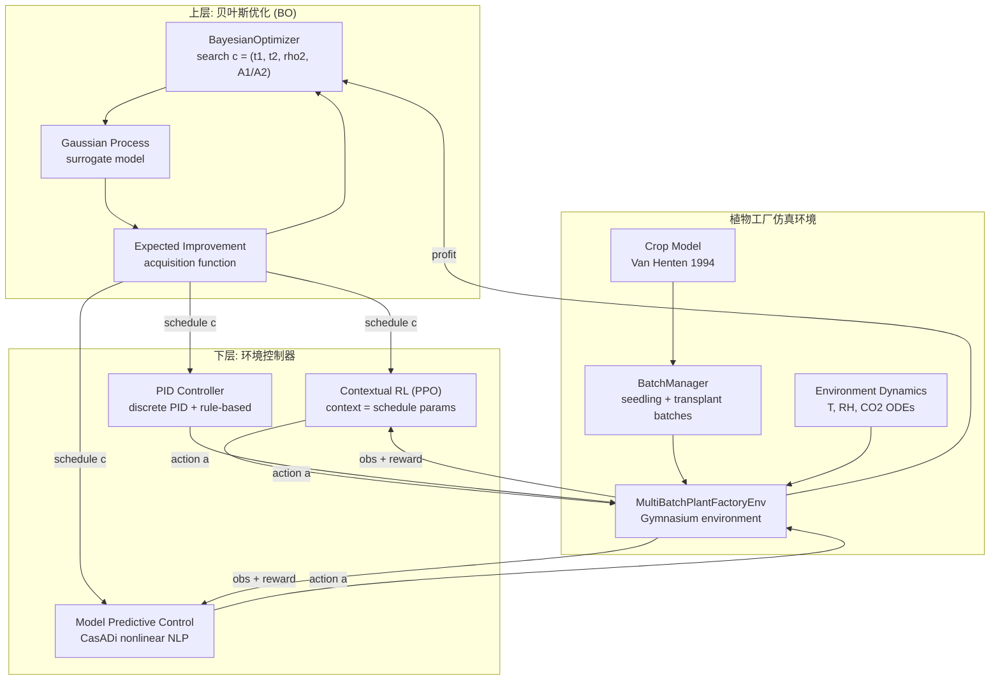

<<<<<<< HEAD
# Plant Factory Optimization

## 耦合静态排程优化与动态轨迹控制的植物工厂双层节能调控方法

---

## 项目概述

本项目实现了一种植物工厂双层节能调控方法，将**静态排程优化**（上层）与**动态轨迹控制**（下层）相结合。

- **上层（BO）**：使用贝叶斯优化（Bayesian Optimization）搜索最优排程参数 c = (t1, t2, rho2, A1/A2)
- **下层（CRL）**：使用上下文强化学习（Contextual Reinforcement Learning）训练可泛化至不同排程的控制策略

本方法的核心优势在于：
1. **双层协同**：上层优化静态参数，下层训练动态控制，实现全局最优
2. **泛化能力**：上下文RL策略可泛化至未见过的排程，无需为每个排程单独训练
3. **高保真仿真**：基于Van Henten作物模型和PFAL-DRL物理模型的多批次生产仿真
4. **模块化设计**：所有参数可配置，便于调参和扩展

---
flowchart TD
    A["上层：贝叶斯优化排程决策<br/>决策变量: t1, t2, rho2, A1/A2<br/>目标: 年度净利润最大化<br/>← 4维决策变量<br/>t1 ∈ [10, 18] 天<br/>t2 ∈ [18, 26] 天<br/>rho2 ∈ [20, 80] 株/m²<br/>A1/A2 ∈ [0.1, 0.9]"]
    
    B["下层：PFALConventionalController<br/>(PID 基线，比例带控制)"]
    
    C["回到上层更新 GP"]

    A -->|"每代给下层传 schedule"| B
    B -->|"返回年度净利润"| C
    C --> A
---

## 系统架构



---

## 目录结构

```
plant_factory_optimization/
├── configs/                      # 所有配置文件（YAML格式）
│   ├── crop_params.yaml         # 作物模型参数 (Van Henten)
│   ├── container_params.yaml     # 集装箱/工厂物理参数
│   ├── equipment_params.yaml     # 设备参数 (LED, HVAC, CO2等)
│   ├── reward_params.yaml        # 奖励函数参数
│   ├── schedule_params.yaml      # 排程参数空间定义
│   ├── rl_params.yaml            # PPO强化学习参数
│   ├── bo_params.yaml            # 贝叶斯优化参数
│   ├── mpc_params.yaml           # MPC控制器参数
│   ├── experiment_params.yaml    # 实验参数（验证排程、天气）
│   └── controller_params.yaml    # PID/规则控制器参数
├── src/                         # 源代码
│   ├── models/                  # 物理模型
│   │   ├── crop_model.py       # 作物生长模型 (Van Henten)
│   │   ├── environment_model.py # 环境动力学 (T/RH/CO2 ODEs)
│   │   ├── equipment.py         # 设备功率计算
│   │   ├── batch_manager.py     # 多批次管理器 (BatchManager)
│   │   ├── mpc_model.py        # MPC用CasADi符号预测模型
│   │   └── schedule_utils.py   # 排程可行性检查
│   ├── envs/
│   │   ├── plant_factory_env.py # Gymnasium仿真环境 (28维观测+6维动作)
│   │   └── utils.py            # 配置加载、环境辅助函数
│   ├── controllers/
│   │   ├── base_controller.py   # 控制器基类
│   │   ├── rule_controller.py    # 规则控制器 & PID控制器
│   │   ├── rl_controller.py      # 强化学习控制器 (PPO wrapper)
│   │   ├── mpc_controller.py     # MPC控制器 (CasADi非线性NLP)
│   │   └── mpc_experiment.py     # MPC闭环仿真实验框架
│   ├── rl/
│   │   └── training.py          # ContextualPPOTrainer (PPO训练)
│   ├── bo/
│   │   └── bayesian_optimizer.py # BayesianOptimizer (GP优化)
│   └── utils/
│       ├── common.py            # 随机种子、气象数据加载等
│       └── result_logger.py     # 结果记录工具
├── experiments/                  # 实验脚本
│   ├── train.py                # [实验1] RL训练入口
│   ├── mpc_control.py          # MPC评估入口（多种模式）
│   ├── evaluate_controllers.py  # [实验2] 固定排程控制器对比
│   ├── bo_optimization.py      # 基础BO优化
│   └── bo_layer_comparison.py  # [实验3] BO+多控制器对比
├── visualizations/
│   ├── experiment_viz.py       # 三大实验可视化工具
│   └── plot_training.py        # 训练曲线可视化
├── tests/                       # 单元测试
├── data/
│   ├── weather/                # 天气数据 (outdoorWeatherWurGlas2014.csv)
│   └── electricity/            # 电价数据
└── results/                    # 结果目录（自动创建）
    ├── train_YYYYMMDD_HHMMSS/ # 训练结果
    │   ├── models/             # 保存的PPO模型
    │   ├── logs/              # WandB/TensorBoard日志
    │   ├── figures/           # 训练曲线图
    │   └── config.yaml       # 训练配置快照
    ├── exp2_controller_eval/  # 实验2结果
    │   ├── pid_summary.csv
    │   ├── mpc_summary.csv
    │   ├── rl_summary.csv
    │   ├── comparison_summary.csv
    │   ├── pid_trajectory.csv
    │   ├── figures/
    │   │   ├── controller_comparison.png
    │   │   └── controller_radar.png
    │   └── batch_growth.png
    └── exp3_bo_comparison/    # 实验3结果
        ├── pid/
        ├── mpc/
        ├── rl/
        ├── bo_comparison_summary.csv
        └── figures/
            └── bo_convergence.png
```

---

## 快速开始

### 1. 安装依赖

```bash
cd plant_factory_optimization
pip install -r requirements.txt
```

主要依赖：
- Python >= 3.9
- numpy, pandas, matplotlib
- gymnasium
- stable-baselines3 (RL)
- casadi (MPC)
- scikit-optimize / skopt (贝叶斯优化)
- pyyaml

### 2. 验证安装

```bash
pytest tests/ -v
```

### 3. 运行单元测试

```bash
# 测试作物模型
python -m pytest tests/test_crop_model.py -v

# 测试环境模型
python -m pytest tests/test_environment_model.py -v
```

---

## 三大实验

### Experiment 1: 上下文强化学习训练

训练上下文PPO策略，在多样排程上泛化。

```bash
# 默认训练（5M步，使用WandB）
python experiments/train.py --config configs/rl_params.yaml

# 快速测试（100k步，禁用WandB）
python experiments/train.py --config configs/rl_params.yaml \
    --total_timesteps 100000 --no_wandb --viz

# 指定随机种子
python experiments/train.py --seed 42 --no_wandb --viz

# 仅评估已有模型
python experiments/train.py --eval_only \
    --model_path results/models/best_model.zip
```

**输出目录**: `results/train_YYYYMMDD_HHMMSS/`
| 文件 | 说明 |
|------|------|
| `models/best_model.zip` | 验证集最优模型 |
| `models/final_model.zip` | 最终模型 |
| `logs/evaluations.csv` | 每轮评估指标 |
| `figures/training_curves.png` | 训练曲线 |

**可视化内容**（`training_curves.png`）:
- 每轮平均episode奖励（原始值 + SMA滑动平均）
- 每轮平均episode长度
- 奖励标准差（策略稳定性）
- 每轮采收质量

---

### Experiment 2: 固定排程下控制器对比评估

在固定排程集合上，对比 **PID / MPC / ContextualRL** 三种控制器的性能。

```bash
# 完整三控制器对比（需先训练RL模型）
python experiments/evaluate_controllers.py \
    --mode all --n_runs 3 --save

# 仅MPC（适合快速验证）
python experiments/evaluate_controllers.py \
    --mode mpc --n_runs 3 --Np 8 --save

# 仅PID
python experiments/evaluate_controllers.py \
    --mode pid --n_runs 3 --save

# 指定RL模型路径
python experiments/evaluate_controllers.py \
    --mode rl --rl_model results/models/best_model.zip --n_runs 3

# 指定排程参数
python experiments/evaluate_controllers.py \
    --mode all --t1 14 --t2 21 --rho2 50 --A1_A2 0.5 \
    --n_runs 3 --save

# 指定保存目录
python experiments/evaluate_controllers.py \
    --mode all --save --save_dir results/my_eval
```

**排程参数说明**:
| 参数 | 说明 | 默认值 | 范围 |
|------|------|--------|------|
| `--t1` | 育苗期天数 | 14 | [10, 18] |
| `--t2` | 定植期天数 | 21 | [18, 26] |
| `--rho2` | 定植区种植密度 (株/m²) | 35 | [20, 80] |
| `--A1_A2` | 育苗/定植面积比 | 0.5 | [0.1, 5.0] |

**输出目录**: `results/exp2_controller_eval/`
| 文件 | 说明 |
|------|------|
| `pid_summary.csv` | PID每轮性能摘要 |
| `mpc_summary.csv` | MPC每轮性能摘要 |
| `rl_summary.csv` | RL每轮性能摘要 |
| `comparison_summary.csv` | 三控制器横向对比 |
| `{pid,mpc,rl}_trajectory.csv` | 完整步级轨迹 |
| `figures/controller_comparison.png` | 对比柱状图 |
| `figures/controller_radar.png` | 雷达图 |
| `figures/trajectory_{ctrl}.png` | 环境变量时序图 |

**评估指标**:
| 指标 | 说明 |
|------|------|
| `total_reward` | 累计奖励（越高越好） |
| `violation_rate` | 约束违反率（越低越好） |
| `total_cost_yuan` | 总能耗成本（越低越好） |
| `harvest_mass_kg` | 采收总质量（越高越好） |
| `T_mean` | 平均温度（应接近22°C） |
| `avg_mpc_solve_time` | MPC平均求解时间（仅MPC） |

---

### Experiment 3: BO+下层控制器联合优化对比

上层贝叶斯优化使用不同下层控制器，评估哪种组合获得最高利润。

```bash
# 三种控制器完整对比（默认PID+MPC+RL）
python experiments/bo_layer_comparison.py \
    --modes pid mpc rl --n_iter 30 --n_eval_repeats 3 --save --viz

# 仅MPC（精确评估，推荐 n_iter >= 20）
python experiments/bo_layer_comparison.py \
    --modes mpc --n_iter 30 --mpc_Np 8 --n_eval_repeats 3 --save

# 指定RL模型
python experiments/bo_layer_comparison.py \
    --modes rl --rl_model results/models/best_model.zip \
    --n_iter 30 --save --viz

# 仅PID（最快，适合超参数调优）
python experiments/bo_layer_comparison.py \
    --modes pid --n_iter 30 --n_eval_repeats 1 --save

# 指定保存目录
python experiments/bo_layer_comparison.py \
    --modes pid mpc --save --save_dir results/my_bo
```

**关键参数**:
| 参数 | 说明 | 推荐值 |
|------|------|--------|
| `--n_iter` | BO迭代次数 | 20-50（越多越精确） |
| `--n_initial_points` | 初始随机探索点数 | 8-15 |
| `--n_eval_repeats` | 每次排程评估的重复次数 | 1-3 |
| `--mpc_Np` | MPC预测步数（BO中用小值加速） | 4-8 |

**输出目录**: `results/exp3_bo_comparison/`
| 文件 | 说明 |
|------|------|
| `pid/bo_pid_results.yaml` | PID+BO最优结果 |
| `mpc/bo_mpc_results.yaml` | MPC+BO最优结果 |
| `rl/bo_rl_results.yaml` | RL+BO最优结果 |
| `bo_comparison_summary.csv` | 最优利润对比表 |
| `figures/bo_convergence.png` | 收敛曲线对比图 |

**BO收敛曲线图内容** (`bo_convergence.png`):
- 子图1：三控制器的每轮利润 + best-so-far曲线
- 子图2：归一化best-so-far对比（所有控制器叠加）
- 子图3：最优排程参数柱状图

---

## 配置文件说明

所有参数均通过YAML配置文件管理，每个参数都有详细的来源标注：

| 来源标识 | 说明 |
|---------|------|
| `PFAL-DRL` | 来自PFAL-DRL开源项目的参数 |
| `Van Henten 1994` | 来自Van Henten温室模型论文的参数 |
| `RL-SMPC` | 来自RL-SMPC项目的参数 |
| `论文方法部分` | 来自本论文方法章节的参数 |
| `暂定-需调整` | 需要根据实际情况调整的参数 |

**重要**：所有惩罚系数、约束范围等超参数均**不在代码中硬编码**，全部在配置文件中定义。

---

## 观测空间详解 (28维)

| 索引 | 变量 | 范围 | 单位 |
|------|------|-------|------|
| 0 | 箱内温度 | [15, 40] | °C |
| 1 | 箱内相对湿度 | [0, 100] | % |
| 2 | 箱内CO2浓度 | [300, 1500] | ppm |
| 3 | 外界温度 | [-20, 40] | °C |
| 4 | 外界相对湿度 | [0, 100] | % |
| 5 | 外界CO2浓度 | [300, 1500] | ppm |
| 6 | 实时电价 | [0.3, 1.0] | 元/kWh |
| 7 | 总叶面积指数 | [0, 6] | - |
| 8 | 育苗区总干重 | [0, 5000] | g |
| 9 | 定植区总干重 | [0, 5000] | g |
| 10 | 最老批次剩余天数 | [0, t2] | d |
| 11 | 最老批次干重 | [0, 30] | g |
| 12 | 育苗区LAI | [0, 3] | - |
| 13 | 定植区LAI | [0, 3] | - |
| 14-19 | 上步动作 | 见下表 | - |
| 20 | 小时归一化 | [0, 1] | - |
| 21 | 周期天数归一化 | [0, 1] | - |
| 22 | t1 (育苗期) | [10, 18] | d |
| 23 | t2 (定植期) | [18, 26] | d |
| 24 | rho2 (定植密度) | [20, 80] | 株/m² |
| 25 | A1/A2 (面积比) | [0.1, 0.9] | - |
| 26 | 总蒸腾归一化 | [0, 1] | - |
| 27 | 总光合归一化 | [0, 1] | - |

---

## 动作空间详解 (6维)

| 索引 | 变量 | 范围 | 单位 |
|------|------|-------|------|
| 0 | 育苗区光强 I1 | [0, 600] | μmol/m²/s |
| 1 | 定植区光强 I2 | [0, 600] | μmol/m²/s |
| 2 | HVAC热功率 Q_HVAC | [-212, 212] | W/m² |
| 3 | CO2注入 u_CO2 | [0, 0.5] | g/m²/h |
| 4 | 通风率 V_vent | [0, 0.5] | m³/s |
| 5 | 除湿率 m_dehum | [0, 0.002] | kg/s |

---

## 奖励函数

```
r_t = r_t^growth + r_t^event + r_t^cost + r_t^penalty
```

### 生长收益
```
r_t^growth = α × (M_transplant + γ × M_seedling) × 1000
```
- α = 0.25 元/g（干物质单价）
- γ = 0.5（育苗区折算系数）

### 能耗成本
```
r_t^cost = -(p_elec × E_total + p_CO2 × u_CO2)
```

### 约束惩罚
- 温度越限：-10 元/步
- 暗期不足（< 4h）：-10 元/步
- DLI偏离：-1 元/(mol/m²)
- 采收不达标：-200 元
- 移栽不达标：-100 元

---

## 可视化工具（独立使用）

除了三大实验内置的可视化外，`visualizations/experiment_viz.py` 也可独立导入使用：

```python
from visualizations.experiment_viz import (
    plot_training_curves,        # 训练曲线
    plot_controller_comparison,  # 控制器对比
    plot_bo_convergence,         # BO收敛曲线
    plot_environment_trajectory, # 环境轨迹
    plot_batch_growth,          # 批次生长
    auto_plot,                  # 根据类型自动可视化
)

# 训练曲线
plot_training_curves(
    log_dir='results/train_xxx/logs',
    save_dir='results/train_xxx/figures',
    window=50,
)

# 控制器对比（需先运行实验2）
plot_controller_comparison(
    results_dir='results/exp2_controller_eval',
    save_dir='results/exp2_controller_eval/figures',
)

# BO收敛（需先运行实验3）
plot_bo_convergence(
    results_dir='results/exp3_bo_comparison',
    save_dir='results/exp3_bo_comparison/figures',
)

# 一键可视化
auto_plot('train', 'results/train_xxx')
auto_plot('eval', 'results/exp2_controller_eval')
auto_plot('bo', 'results/exp3_bo_comparison')
```

---

## 论文引用

如果使用本项目，请引用：

> Plant Factory Optimization: A Bi-level Energy-saving Control Method
> Coupling Static Scheduling with Dynamic Trajectory Control

---

## 许可证

MIT License
=======
# plant_factory_optimization
>>>>>>> cf3d3b8e87a994f91f0c32a18c84a9685af76363
